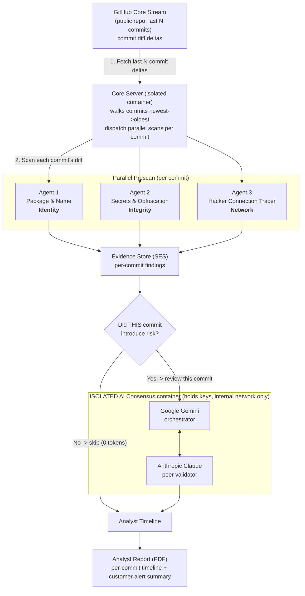

# SecureChain — Software Supply-Chain Recon

SecureChain is an **analyst recon aid** for software supply-chain threats. Given a public GitHub repository, it walks the **most recent commits** and analyzes **each commit's diff independently** — because the interesting signal is what a *new* commit **introduces over time**, not the repository's initial/clean state.

Specialized scanner agents run **in parallel** on every commit — including an **IOC Matcher** that checks for known indicators of compromise. Only commits that actually introduce risk are escalated to a two-model **consensus** (Google Gemini + Anthropic Claude) running in an **isolated container**. Clean commits never reach the AI, so the pipeline stays token-cheap. The output is a concise, **analyst-facing report** with a ready-to-send customer alert summary.

No mock data: every finding comes from real commit diffs and real AI review.

## Why this design

- **The initial analysis is never the interesting part.** Value comes from catching risk that shows up in a *later* commit. SecureChain processes commits as deltas over time.
- **Token-efficient.** A commit diff is usually small. Deterministic scanners run on every commit (free); the AI consensus only runs on commits that introduced findings. Clean commits cost **zero tokens**.
- **Built for recon + analysts** to alert a customer about a specific repo — not a heavyweight platform.
- **Isolation.** The AI layer runs in its own hardened container that alone holds the API keys and is **not exposed to the host**. The core server holds no keys and reaches the AI only over an internal Docker network.

## Architecture (Parallel, Per-Commit)



### How it works

1. **GitHub Core Stream** — Fetches only the **commit diff deltas** of the last N commits from a public repo.
2. **Per-commit analysis** — For each commit (newest → oldest), the scanner agents run **in parallel** on that commit's diff:
   - **Agent 1 — Package & Name Checker** (Identity): typosquatting, dependency confusion, install hooks.
   - **Agent 2 — Scrambled Code & Secret Leak Scanner** (Integrity): exposed secrets, obfuscated code.
   - **Agent 3 — Hacker Connection Tracer** (Network): suspicious endpoints, sockets, exfiltration.
   - **IOC Matcher** (Indicators): matches the diff against curated lists of **known-bad indicators** — malicious npm/PyPI package names, C2 / exfiltration infrastructure, high-risk TLDs, and download-execute / reverse-shell command patterns.
3. **Token gate** — If a commit introduced no findings, it's marked clean and **skipped** (no AI tokens). If it introduced risk, only that commit's small evidence set is sent to the isolated AI service.
4. **Consensus** — **Gemini** orchestrates (organizes the evidence, initial verdict); **Claude** validates (filters false positives/noise, confirms it's worth alerting, checks fixes).
5. **Analyst report** — A per-commit timeline, a dedicated **Indicators of Compromise (IOC)** section, plus a ready-to-send **customer alert summary** for the specific repo, downloadable as a professional PDF.

## IOC detection (and what we honestly do *not* claim)

SecureChain performs **IOC (Indicator of Compromise) detection**: the IOC Matcher checks each commit diff against curated lists of known-bad indicators (malicious package names from documented campaigns, C2 / exfiltration infrastructure, abused free-hosting and paste sites, high-risk TLDs, and download-execute / reverse-shell patterns). Every IOC match is then **validated in context by the AI consensus** (e.g. distinguishing a real exfil endpoint from a docs link or a test fixture) and surfaced in both the dashboard and the PDF report.

**We do *not* claim "zero-day" detection.** A zero-day is a *previously-unknown* vulnerability; matching against known indicators is, by definition, the opposite. The closest honest framing of the tool's novel-risk capability is **AI-assisted detection of newly-introduced suspicious code in recent commits** — the consensus reasoning about a freshly-added change — which is related to, but should not be marketed as, zero-day discovery.

## Isolation & Hardening

| Container | Holds AI keys? | Exposed to host? | Talks to |
|-----------|----------------|------------------|----------|
| `SecureChain-core` | No | Yes (port 8000) | GitHub (read) + internal AI service |
| `SecureChain-ai` | **Yes** | **No** (internal network only) | Gemini / Claude APIs |

Both containers run **non-root**, with `read_only` root filesystem, `cap_drop: ALL`, and `no-new-privileges`. The AI consensus service has **no published ports**, so it is unreachable from the host — only the core can call it over the internal Docker network.

## Tech Stack

| Layer | Technology |
|-------|-----------|
| Core Server | Python + FastAPI (async, parallel per-commit dispatch) |
| GitHub Core Stream | GitHub REST API (public repos) via httpx |
| Scanner Agents | Deterministic Python evidence collectors |
| AI Consensus (isolated) | Google Gemini (`google-genai`) + Anthropic Claude (`anthropic`) |
| Report | fpdf2 (analyst-style PDF) |
| Dashboard | Vanilla JS + D3.js (kept minimal) |
| Orchestration | Docker Compose (2 hardened containers) |

## Setup

1. Add your API keys to `.env`:

```
ANTHROPIC_API_KEY=sk-ant-...
GEMINI_API_KEY=...
```

2. Build and run:

```bash
docker compose up -d --build
```

3. Open **http://localhost:8000** (the dashboard), or use the API directly.

## Usage (API)

```bash
# Start a scan of the last 8 commits
curl -X POST http://localhost:8000/api/scan \
  -H 'Content-Type: application/json' \
  -d '{"repo_url": "expressjs/express", "max_commits": 8}'
# -> {"scan_id": "abc123..."}

# Poll status / per-commit results
curl http://localhost:8000/api/scan/<scan_id>

# Generate + download the analyst PDF
curl -X POST http://localhost:8000/api/scan/<scan_id>/report
curl -OJ http://localhost:8000/api/scan/<scan_id>/report/download
```

| Endpoint | Method | Description |
|----------|--------|-------------|
| `/api/scan` | POST | Start a scan `{repo_url, max_commits}` → `{scan_id}` |
| `/api/scan/{id}` | GET | Per-commit timeline, events, aggregate risk |
| `/api/scan/{id}/report` | POST | Generate the analyst PDF |
| `/api/scan/{id}/report/download` | GET | Download the PDF |
| `/api/health` | GET | Core + isolated AI service status |

## Project Structure

```
SecureChain/
├── docker-compose.yml          # 2 hardened, isolated containers
├── .env.example
├── README.md
├── backend/                    # Core Server (no AI keys)
│   ├── Dockerfile              # non-root
│   ├── requirements.txt
│   ├── main.py                 # per-commit orchestration + token gate
│   ├── github_stream.py        # GitHub Core Stream (diff deltas)
│   ├── evidence_store.py       # Evidence Store (per-commit)
│   ├── ai_client.py            # HTTP client -> isolated AI service
│   ├── report_generator.py     # analyst PDF (timeline + alert summary)
│   └── scanners/
│       ├── package_checker.py  # Agent 1 — Identity
│       ├── secret_scanner.py   # Agent 2 — Integrity
│       ├── network_tracer.py   # Agent 3 — Network
│       ├── ioc_matcher.py      # IOC Matcher — Indicators
│       └── ioc_indicators.py   # curated IOC lists
├── ai-consensus/               # ISOLATED AI service (holds the keys)
│   ├── Dockerfile              # non-root, no published ports
│   ├── requirements.txt
│   ├── service.py              # FastAPI /review endpoint (internal only)
│   └── consensus.py            # Gemini orchestrator + Claude validator
└── frontend/                   # minimal dashboard (D3.js)
    ├── index.html
    ├── style.css
    └── app.js
```
