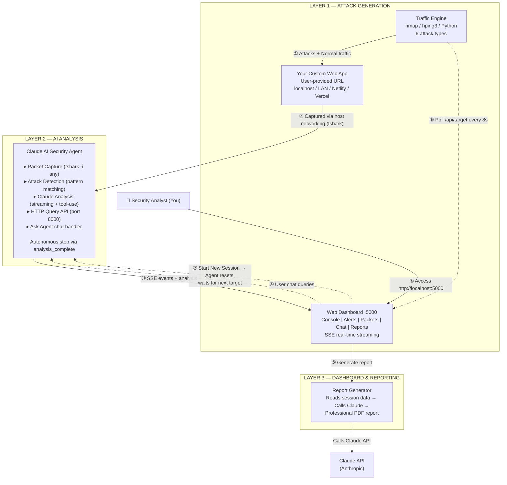

# PacketSentry — Autonomous Penetration Testing

PacketSentry is a fully containerized network penetration testing platform where a **Claude-powered AI agent** uses **Wireshark (tshark)** to capture, analyze, and attack live network traffic in real-time. You provide a **custom web application URL**, and the platform autonomously scans, probes, and analyzes it — no mock data, everything is real.

> **Full technical documentation**: [docs/technical-documentation.md](docs/technical-documentation.md) — covers every component, data flow, attack scenario, event type, and schema in detail with architecture diagrams.

## Architecture



### Data Flow (numbered arrows in the diagram)

| # | From | To | What |
|---|------|----|------|
| ① | Traffic Engine | Your Custom Web App | Real attacks: SYN flood, port scan, Slowloris, DNS amp, dir bust, TCP scan |
| ② | Your Custom Web App | Claude Agent | Traffic captured via `tshark -i any` (host networking) |
| ③ | Claude Agent | Web Dashboard | SSE events: thinking, commands, alerts, analysis results, session state |
| ④ | Web Dashboard | Claude Agent | "Ask the Agent" chat queries forwarded to agent's HTTP API |
| ⑤ | Web Dashboard | Report Generator | Triggers PDF generation: reads session data → calls Claude → builds PDF |
| ⑥ | You (Analyst) | Web Dashboard | Access dashboard at http://localhost:5000 |
| ⑦ | Web Dashboard | Claude Agent | "Start New Session" clears target, agent waits for next URL |
| ⑧ | Traffic Engine | Web Dashboard | Polls /api/target every 8s to discover the target URL |

## Prerequisites

- **Docker 24+** and **Docker Compose v2** (Docker Desktop on Windows/Mac, or Docker Engine on Linux)
- **WSL2 backend** on Windows (Docker Desktop with WSL2 is required for host networking support)
- **Anthropic API key** — get one at https://console.anthropic.com
- Minimum **4GB RAM**, **10GB free disk**
- A **custom web application** you own or are authorized to test (can be on localhost, LAN, or a private server)

## Tech Stack

| Category | Technology |
|----------|-----------|
| **AI Engine** | Claude (claude-sonnet-4-6) via Anthropic API — streaming responses with tool-use |
| **Packet Capture** | tshark (Wireshark CLI) — `-i any` with host networking, runs as root |
| **Traffic Generation** | nmap, hping3, raw Python sockets (SYN flood, Slowloris, DNS amplification, etc.) |
| **Backend** | Python 3.11, Flask, Gunicorn — SSE streaming, REST API, in-memory event store |
| **Frontend** | Vanilla JS (no frameworks) — dark SOC-themed SPA with 5-tab layout |
| **Report Generation** | fpdf2 (PDF layout) + Claude API (content generation) — professional multi-section reports |
| **Containerization** | Docker Compose — 3 containers on isolated bridge network (172.30.0.0/24) + host-networking agent |
| **OS Support** | Windows (Docker Desktop + WSL2), macOS, Linux |

## Quick Start

### Phase 1 — Start Infrastructure

```bash
# Clone the repo
git clone https://github.com/ritvikindupuri/PacketSentry.git
cd PacketSentry

# Create .env from template and edit it
cp .env.example .env
# Edit .env and set ANTHROPIC_API_KEY=sk-ant-... (REQUIRED)
# CLAUDE_MODEL=claude-sonnet-4-6 (optional, defaults shown)
# MIN_TOOL_CALLS_FOR_COMPLETE=3 is a guardrail: Claude must run at least this many
#   tshark commands per cycle before it can declare analysis complete. This prevents
#   premature "all clear" decisions. 0=disabled, 1-2=quick, 3=recommended, 4-6=deep.
#   See the "Completion guardrail" section below for the full table.

# Start infrastructure (Dashboard, Traffic Engine)
docker compose up -d

# Wait ~10 seconds
```

### Phase 2 — Configure Target & Start Agent

```bash
# Start the Claude agent
docker compose --profile attack up -d claude-agent

# Open the dashboard
open http://localhost:5000   # macOS: use 'open'; Windows: use 'start' or type URL in browser
```

1. **Dashboard opens to setup screen** — enter your custom web app URL (e.g., `http://192.168.1.50:3000` or `http://localhost:8080`)
2. Click **Start** — the URL is validated (private/local only, public sites blocked)
3. The agent immediately begins analyzing traffic to/from your target
4. The traffic engine starts generating attack traffic within 30-90 seconds

```bash
# Follow the agent's analysis in real-time
docker compose logs -f claude-agent
# Expected: "[Cycle 1] 45 pkts, 2 alerts, threat: medium"
```

### What You'll See

- **Agent Console tab** — Claude's real-time thinking, tshark commands, and analysis results
- **Alerts tab** — detected threats with severity, MITRE mapping, and AI verdicts
- **Live Packets tab** — raw packet data streaming in from tshark captures
- **Ask Agent tab** — chat interface to query Claude about current network state
- **Session Complete card** — when the agent finishes autonomously, a summary card appears showing total cycles, final threat level, stop reason, and a "Start New Session" button to begin again with a new target

The agent runs adaptively — Claude decides when it's thoroughly analyzed the target. Simple sites finish fast, complex apps get more cycles. Safety limits prevent infinite loops. See [docs/technical-documentation.md](docs/technical-documentation.md#314a-autonomous-session-lifecycle) for details.

**Completion guardrail (`MIN_TOOL_CALLS_FOR_COMPLETE`)**: To prevent premature "all clear" decisions, the agent requires Claude to execute a minimum number of investigative tool checks (tshark commands, packet captures, statistics queries) before it is allowed to declare `analysis_complete: true`. Set it in your `.env` file as `MIN_TOOL_CALLS_FOR_COMPLETE=N` where `N` is:

| Value | Behavior | Recommended for |
|-------|----------|-----------------|
| `0` | Disabled — Claude can stop anytime, even without running any tools | Not recommended |
| `1` | At least 1 tool command per cycle | Quick sanity checks |
| `2` | At least 2 tool commands per cycle | General use (minimum recommended) |
| `3` | At least 3 tool commands per cycle | **Default — recommended for most users** |
| `4-6` | 4-6 tool commands per cycle | Thorough, methodical investigation |
| `7+` | 7+ tool commands per cycle | Very deep analysis (may slow down cycles) |

Default is **3** if unset. Higher values force more thorough investigation per cycle but increase analysis time and API cost.

## Using the Dashboard

Open **http://localhost:5000** — you'll first see the **setup screen** to enter your target URL. After setup, the dashboard has 5 tabs:

### 1. Agent Console (default)
Shows everything the agent does in real-time:
- **Analysis cycles** — Each cycle begins with a header showing packet count and alert count
- **Claude's thinking** — Streams character-by-character (typewriter effect) via SSE
- **Command execution** — When Claude runs a tshark command, a command card appears with output
- **Final analysis** — Summary card with threat level, attack name, MITRE mapping, and recommendations
- **Session Complete card** — Appears automatically when the agent finishes its analysis cycle limit

### 2. Alerts & Analysis
A feed of all detected security alerts sorted by severity with filter buttons.

### 3. Live Packets
Raw packet table showing source/destination IPs, ports, protocol, info summary, and frame length.

### 4. Ask the Agent
Chat interface to ask about current network state, specific hosts, or protocols. Usable during and after analysis.

### 5. Reports
Generate downloadable PDF reports with content written by Claude AI. Click "Generate Report" — Claude analyzes all session data (alerts, packets, activity) and produces a professionally formatted PDF with:
- **Cover page**: white/blue design with severity bar chart, metadata box
- **Executive Summary**: AI-generated security posture overview with business impact
- **Key Findings**: detailed findings with severity, MITRE ATT&CK mapping, confidence, remediation steps
- **Attack Timeline**: chronological log of all detected events
- **Traffic Analysis**: protocol distribution, top talkers, anomalies
- **Recommendations**: color-coded by priority (P0 red, P1 orange, P2 navy)
- **Conclusion**: final assessment and outlook

Falls back to heuristic analysis if the Claude API call fails.

## How It Works

1. You provide a **custom web application URL** through the dashboard setup screen
2. The URL is validated against the rules below — a brief AI-generated reason explains why it was accepted
3. Once validated, the **Claude agent** begins capturing all traffic to/from your target via tshark
4. The **traffic engine** starts generating real attack traffic (nmap scans, SYN floods, directory brute force, Slowloris) against your target
5. The agent detects attacks, runs tshark commands to investigate, and streams its analysis to the dashboard in real-time
6. The agent **stops autonomously** — Claude itself decides when analysis is complete based on what it found about the target. Simple sites finish in fewer cycles; complex apps get deeper investigation. Safety limits prevent infinite loops.
7. After completion, the agent **waits for a new target** — click "Start New Session" on the session card to run again without restarting containers

## How the Agent Works

1. **Capture**: Agent uses `tshark -i any` (host networking) to capture all host network traffic. tshark runs as root inside the container — this is required for raw packet capture and is standard for any packet analysis tool (Wireshark, tcpdump, etc.)
2. **Detect**: Custom `AttackDetector` identifies port scans, SYN floods, DNS tunneling, data exfiltration
3. **Stream Analysis via Claude API**:
   - Packet summaries + alerts are sent to Claude with tool-use capability
   - Claude's streaming responses push to the dashboard in real-time via SSE
   - Claude runs tshark commands mid-analysis and uses the output for deeper investigation
4. **Stop Autonomously**: Claude itself decides when analysis is complete (`analysis_complete` flag). A simple static site finishes in 1-2 cycles; a complex app gets deeper investigation. `MAX_CYCLES` (default 8) is a safety limit, and `NO_ALERT_STOP` (default 3) catches clean targets early.
5. **Multi-Session**: After a session completes, click "Start New Session" on the dashboard to enter a new target URL — the agent handles it without any container restarts
6. **Ask**: Chat interface lets you query the agent directly about current network state

The session lifecycle is: **Starting** → **Waiting** (for target URL) → **Analyzing** (N cycles) → **Complete** → **Waiting** (for next target). The entire process runs without manual intervention after the target URL is configured.

## Attack Scenarios

The traffic engine autonomously generates these REAL attacks against your custom target:

| # | Attack | Tool | MITRE |
|---|--------|------|-------|
| 1 | **TCP SYN Port Scan** | nmap -sS | T1046 - Network Service Discovery |
| 2 | **SYN Flood DoS** | hping3 --flood | T1498 - Network DoS |
| 3 | **Slowloris HTTP** | Custom socket pool | T1499 - Endpoint DoS |
| 4 | **TCP Connect Scan** | Python raw sockets | T1046 - Network Service Discovery |
| 5 | **Directory Brute Force** | HTTP requests | T1595 - Active Scanning |
| 6 | **DNS Amplification** | Raw UDP sockets | T1498 - Network DoS |

## URL Validation Rules

When you enter a URL on the dashboard setup screen, these rules determine what's allowed:

| Result | Types | Examples |
|--------|-------|----------|
| **✅ Allowed** | Private/local IPs — self-hosted apps on your network | `http://localhost:3000`, `http://192.168.1.50:8080`, `http://10.0.0.5` |
| **✅ Allowed** | Custom apps on public hosting platforms | `https://my-site.netlify.app`, `https://my-app.vercel.app` |
| **❌ Blocked** | Major public websites | `google.com`, `facebook.com`, `youtube.com`, `github.com`, `amazon.com`, `reddit.com` and similar |

When a URL is accepted, a brief AI-generated reason appears explaining why the URL was allowed (e.g., *"Domain (my-site.netlify.app) is hosted on Netlify — a custom application hosting platform. Not on the blocked sites list."*). For the best experience, deploy a custom web app to a hosting platform or run one locally.

### Recommended: Build a Test Target with Lovable

For the best results, create a dedicated test application using **[Lovable](https://lovable.dev)** — an AI-powered web app builder (vibe coding). A simple CRUD app, API endpoint, or basic dashboard with login functionality gives the agent plenty to analyze:

1. Go to https://lovable.dev and describe the app you want (e.g., "a simple task manager with user login")
2. Export or deploy your app (Netlify, Vercel, or run locally)
3. Enter the URL into PacketSentry's dashboard

Lovable-generated apps work especially well because they contain realistic login pages, API calls, and data that the agent can probe for vulnerabilities.

## Access the UIs

| Interface | URL | Credentials |
|-----------|-----|-------------|
| **PacketSentry Dashboard** | http://localhost:5000 | None (setup screen first) |

## How to Use

1. Open the **Dashboard** at http://localhost:5000
2. Enter the **target URL** of a web app you control (e.g. `http://192.168.1.100:8080`, `http://localhost:8080`, or a Netlify/Vercel staging URL)
3. Click **Start** — the traffic engine begins generating attacks and the AI agent starts analyzing
4. Watch the **5 tabs** populate with real data: Agent Console (thinking + commands), Alerts (detected attacks), Live Packets (captured traffic), Ask Agent (chat with Claude), Reports (downloadable PDF)
5. Made a mistake on the URL? Click **New Target** in the Agent Console toolbar to reset and go back to the URL entry screen
6. The agent **stops autonomously** when it determines analysis is complete — a "Session Complete" banner appears

## Services

| Service | Container | Ports | Description |
|---------|-----------|-------|-------------|
| **Claude Agent** | `packetsentry-agent` | 8000 (query API) | AI security analyst with tshark |
| **Traffic Engine** | `packetsentry-engine` | — | Generates normal + attack traffic |
| **Dashboard** | `packetsentry-dashboard` | 5000:5000 | Real-time web UI with SSE streaming |

## Understanding the Traffic You'll See

The agent captures and analyzes **two categories of network traffic** simultaneously:

### 1. Attack Traffic (from traffic-engine)
The `traffic-engine` container generates real attacks using nmap, hping3, and raw sockets targeting your custom web app. This includes SYN floods, port scans, Slowloris connection holds, and directory brute force attempts.

### 2. Host Traffic (your computer)
Because the agent uses `network_mode: host` with `tshark -i any`, it captures **everything on your computer's network interfaces** — your browser traffic, system updates, background noise, etc. This is intentional — a real SOC analyst sees all host traffic too.

The agent's AI distinguishes between the two, focusing its analysis on suspicious patterns while still logging everything.

## Troubleshooting

**Dashboard shows setup screen on every reload**
→ The target URL is stored in memory. If the dashboard container restarts, re-enter the URL.

**Agent shows "API key not configured"**
→ Verify `ANTHROPIC_API_KEY` is set correctly in `.env` and restart: `docker compose --profile attack up -d claude-agent`

**Agent can't see any traffic**
→ On Linux, ensure host networking works. On Windows, use Docker Desktop with WSL2 backend. Check `docker compose logs claude-agent` for `tshark: No interface can be used`

**No alerts appearing**
→ Wait 30-90s for the traffic engine to start its first attack cycle. Check `docker compose logs traffic-engine`

**Dashboard shows "Agent not reachable"**
→ The agent uses host networking and its query API on port 8000. Ensure it's running: `docker compose --profile attack ps`

**Agent stopped showing results in console**
→ The agent stops autonomously after completing its analysis (see "How the Agent Works"). A "Session Complete" card appears in the console with total cycles and final threat level. Refresh the page and re-enter a target URL to start a new session.

**URL validation rejects my target**
→ The target must be a private/internal URL (localhost, 192.168.x.x, 10.x.x.x, etc.). Public sites like google.com, amazon.com are blocked. Make sure your URL includes the scheme (http:// or https://).

**Reset everything**
→ `docker compose down -v && docker compose --profile attack down -v`

## Project Structure

```
packetsentry/
├── docker-compose.yml           # 3-service orchestrator (agent, engine, dashboard)
├── .env.example                 # API key template
├── .gitignore
├── README.md
├── claude-agent/
│   ├── Dockerfile               # Ubuntu + tshark + Python + Claude SDK
│   ├── requirements.txt
│   ├── agent.py                 # Main agent loop + streaming Claude + tool execution
│   ├── capture.py               # tshark wrapper with continuous capture
│   └── attack_detector.py       # Pattern-based attack detection
├── traffic-engine/
│   ├── Dockerfile               # Ubuntu + nmap, hping3
│   ├── requirements.txt
│   └── engine.py                # Normal traffic + attack scheduler (polls dashboard for target)
├── dashboard/
│   ├── Dockerfile               # Flask + gunicorn
│   ├── requirements.txt
│   ├── app.py                   # SSE endpoints + URL validation + setup API + report generation
│   ├── report_generator.py      # Professional PDF report builder (fpdf2 + Claude)
│   └── templates/
│       └── dashboard.html       # Dark-themed SOC-style UI with setup screen + 5 tabs
└── docs/
    ├── architecture.svg         # Detailed architecture diagram
    └── technical-documentation.md  # Full system documentation
```
