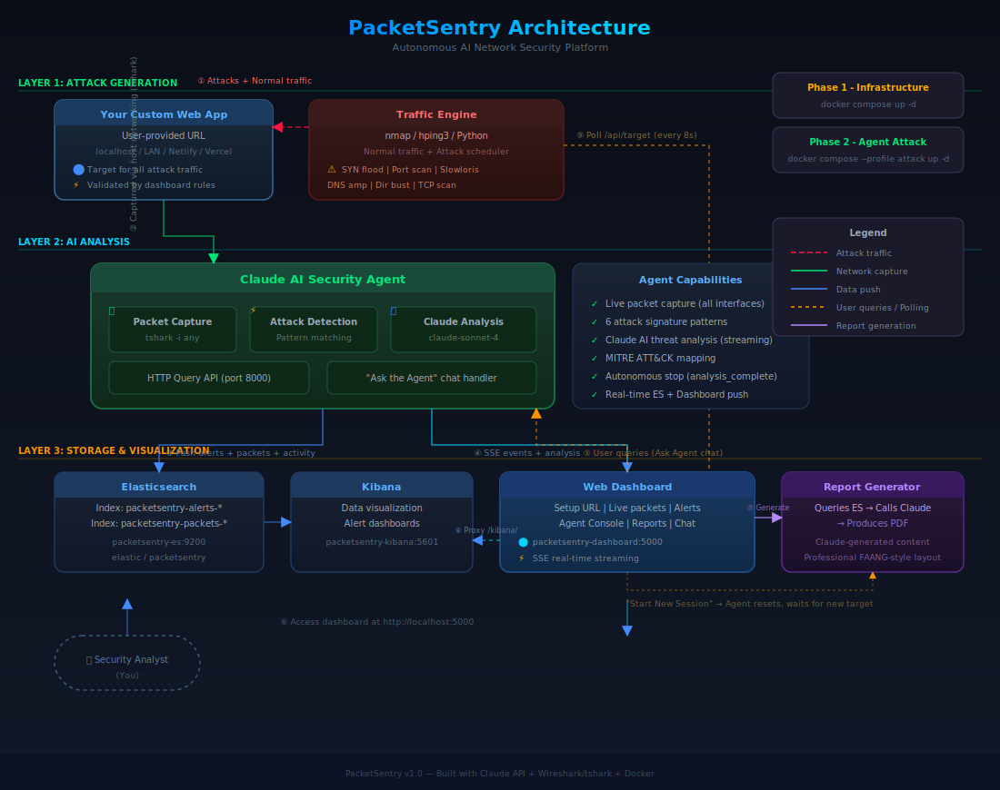

# PacketSentry — Technical Documentation

**Autonomous AI Network Security Platform**

May 26, 2026

**By: Ritvik Indupuri**

---

## Table of Contents

1. [Executive Summary](#1-executive-summary)
2. [System Architecture](#2-system-architecture)
   - 2.1 [Architecture Overview](#21-architecture-overview)
   - 2.2 [Network Topology](#22-network-topology)
   - 2.3 [Data Flow Pipeline](#23-data-flow-pipeline)
   - 2.4 [Component Interaction Matrix](#24-component-interaction-matrix)
3. [Component Deep Dive](#3-component-deep-dive)
   - 3.1 [Claude AI Security Agent](#31-claude-ai-security-agent)
      - 3.1.1 [Agent Orchestrator (agent.py)](#311-agent-orchestrator-agentpy)
      - 3.1.2 [Packet Capture Module (capture.py)](#312-packet-capture-module-capturepy)
      - 3.1.3 [Attack Detection Engine (attack_detector.py)](#313-attack-detection-engine-attack_detectorpy)
      - 3.1.4 [Streaming Claude Integration](#314-streaming-claude-integration)
      - 3.1.4a [Autonomous Session Lifecycle](#314a-autonomous-session-lifecycle)
      - 3.1.5 [Tool-Use Execution Loop](#315-tool-use-execution-loop)
   - 3.2 [Traffic Engine](#32-traffic-engine)
      - 3.2.1 [Normal Traffic Generation](#321-normal-traffic-generation)
      - 3.2.2 [Attack Scheduler](#322-attack-scheduler)
   - 3.3 [Custom Target Application](#33-custom-target-application)
      - 3.3.1 [URL Validation Flow](#331-url-validation-flow)
      - 3.3.2 [Platform Detection](#332-platform-detection)
      - 3.3.3 [Agent & Engine Integration](#333-agent--engine-integration)
   - 3.4 [Web Dashboard](#34-web-dashboard)
      - 3.4.1 [Flask Application (app.py)](#341-flask-application-apppy)
      - 3.4.2 [Dashboard Template (dashboard.html)](#342-dashboard-template-dashboardhtml)
      - 3.4.3 [SSE Real-Time Event Stream](#343-sse-real-time-event-stream)
      - 3.4.4 [Tab Interface](#344-tab-interface)
   - 3.5 [Docker Compose Orchestration](#35-docker-compose-orchestration)
4. [Attack Scenarios](#4-attack-scenarios)
   - 4.1 [TCP SYN Port Scan (nmap -sS)](#41-tcp-syn-port-scan-nmap--ss)
   - 4.2 [SYN Flood Denial of Service (hping3)](#42-syn-flood-denial-of-service-hping3)
   - 4.3 [Slowloris HTTP Attack](#43-slowloris-http-attack)
   - 4.4 [TCP Connect Port Scan](#44-tcp-connect-port-scan)
   - 4.5 [HTTP Directory Brute Force](#45-http-directory-brute-force)
   - 4.6 [DNS Amplification Test](#46-dns-amplification-test)
5. [Real-Time Data Pipeline](#5-real-time-data-pipeline)
   - 5.1 [Event Types Reference](#51-event-types-reference)
   - 5.2 [Agent Console Streaming Flow](#52-agent-console-streaming-flow)
   - 5.3 [Claude Streaming with Tool-Use](#53-claude-streaming-with-tool-use)
6. [Data Models & Schema](#6-data-models--schema)
   - 6.1 [Internal Event Data Structures](#61-internal-event-data-structures)
7. [Security Considerations](#7-security-considerations)
   - 7.1 [Container Security](#71-container-security)
   - 7.2 [Network Security](#72-network-security)
   - 7.3 [API Key Management](#73-api-key-management)
   - 7.4 [Data Isolation](#74-data-isolation)
 8. [Conclusion](#8-conclusion)
    - 8.1 [Future Improvements](#81-future-improvements)

---

## 1. Executive Summary

PacketSentry is a fully containerized, autonomous network security platform that integrates a **Claude-powered AI agent** with **Wireshark (tshark)** for real-time packet capture and analysis. The system creates a complete security operations center (SOC) environment within Docker, where a traffic engine generates realistic attack traffic against target services while the AI agent continuously monitors, analyzes, and reports on all network activity.

### Key Capabilities

- **Real-Time Packet Capture**: The Claude agent uses host-networking mode and tshark to capture all traffic traversing the Docker host's network interfaces, including Docker bridge traffic and external host traffic.
- **AI-Powered Analysis**: Packet summaries and heuristic-based alerts are fed to Anthropic's Claude API, which performs deep semantic analysis to identify threats, map them to the MITRE ATT&CK framework, and provide remediation recommendations.
- **Streaming Intelligence**: Claude's reasoning process is streamed character-by-character to the web dashboard via Server-Sent Events (SSE), showing the agent's chain-of-thought as it happens.
- **Autonomous Tool Execution**: Claude can decide to run tshark commands during analysis, inspect the output, and incorporate the results into its reasoning — all without human intervention.
- **Realistic Attack Simulation**: The traffic engine autonomously generates 6 distinct attack types using real tools (nmap, hping3) against a user-provided custom web application URL.
- **Interactive Query Interface**: Users can ask the agent questions about current network state through the dashboard chat interface.

### Project Scope

The platform consists of 3 Docker containers orchestrated via Docker Compose, deployed across a dedicated bridge network with host-networking for capture capabilities. The user provides their own custom web application URL as the target — no built-in target containers are included. It is designed for security education, demonstration, and research purposes.

---

## 2. System Architecture

### 2.1 Architecture Overview

<div align="center">



*Figure 1: High-level system architecture showing the three logical layers*

</div>

The system is organized into three logical layers:

**Layer 1 — Attack & Victim Network**: Contains the traffic engine and your custom web application (user-provided URL). The traffic engine container exists on the `packetsentry` Docker bridge network (172.30.0.0/24) and generates both legitimate traffic and real cyber attacks against the custom target URL over the host network. The target application itself runs outside of Docker — on your local machine, a LAN server, or a public hosting platform.

**Layer 2 — AI Analysis**: The Claude agent runs with `network_mode: host`, giving it direct access to the host's network stack. It uses tshark to capture live packets (including traffic to/from your custom target), processes them through a heuristic attack detector, and sends summaries to Claude for AI-powered analysis. The agent also hosts an HTTP query API on port 8000.

**Layer 3 — Dashboard & Reporting**: The custom web dashboard stores all session data in-memory and delivers real-time streaming visualization via Server-Sent Events, with on-demand PDF report generation via Claude.

### 2.2 Network Topology

**Figure 2: Container Network Layout**

```
┌─────────────────────────────────────────────────────────────────┐
│                        Docker Host                                │
│  ┌───────────────────────────────────────────────────────────┐   │
│  │              packetsentry Bridge Network                    │   │
│  │              172.30.0.0/24                                 │   │
│  │                                                             │   │
│  │  ┌──────────────┐                                          │   │
│  │  │  traffic-    │─── attacks + normal traffic ──▶  Your    │   │
│  │  │  engine      │    (over host network)          Custom   │   │
│  │  │  (dynamic)   │                                Web App  │   │
│  │  └──────────────┘                                (external)│   │
│  │                                                             │   │
│  │  ┌──────────────┐                                          │   │
│  │  │  dashboard   │                                          │   │
│  │  │  :5000       │                                          │   │
│  │  └──────────────┘                                          │   │
│  └───────────────────────────────────────────────────────────┘   │
│                                                                   │
│  ┌───────────────────────────────────────────────────────────┐   │
│  │              Host Network Stack                             │   │
│  │  ┌────────────────────────────────────────────────────┐    │   │
│  │  │  claude-agent (network_mode: host)                 │    │   │
│  │  │  tshark -i any → captures ALL host traffic         │    │   │
│  │  │  (including traffic-engine ↔ custom web app)      │    │   │
│  │  │  HTTP API on port 8000                             │    │   │
│  │  └────────────────────────────────────────────────────┘    │   │
│  └───────────────────────────────────────────────────────────┘   │
└─────────────────────────────────────────────────────────────────┘
```

*Figure 2: Network topology showing the packetsentry bridge network (172.30.0.0/24) and the agent's host-networking capture interface. The traffic engine sends attacks to the user-provided custom web app URL over the host network, while the agent captures everything via tshark.*

> **Traffic Source**: The agent captures two distinct streams of traffic. **Attack traffic** — generated by the traffic-engine container — consists of real nmap scans, SYN floods, Slowloris, and other attacks targeting your custom web app. This traffic originates from the `packetsentry` bridge network (172.30.0.x) but exits the Docker network to reach the external target. In the dashboard, attack traffic is color-coded **red** (Live Packets tab rows, sidebar stat card tooltip, and packet source badges). **Host traffic** — because the agent uses `network_mode: host` with `tshark -i any` — includes everything traversing the host computer's network interfaces: browser traffic, system processes, background applications, etc. Host traffic is color-coded **blue** in the dashboard. The agent's system prompt instructs Claude to distinguish the two by checking whether source/destination IP falls within the Docker bridge network (`172.30.0.0/24`), and the report generator labels each traffic source accordingly.

### 2.3 Data Flow Pipeline

The system processes data through a continuous pipeline with the following stages:

**Stage 0: Target Discovery**
The traffic engine polls `http://dashboard:5000/api/target` every 8 seconds until a target URL is configured via the dashboard setup screen. Once set, the engine begins generating traffic against that URL.

**Stage 1: Traffic Generation**
The traffic engine (`traffic-engine/engine.py`) runs two concurrent threads: a normal traffic loop that generates HTTP requests and DNS lookups against the custom target URL, and an attack scheduler that randomly selects and executes attacks every 30-90 seconds.

**Stage 2: Packet Capture**
The Claude agent (`claude-agent/capture.py`) uses `tshark -i any` with host networking to capture all network packets. tshark runs as root inside the container — this is required for raw packet capture and is standard for any packet analysis tool. It runs a continuous capture loop in a background thread, storing the most recent 500 packets in a deque buffer.

**Stage 3: Heuristic Detection**
Every 8 seconds, the agent's main loop takes the most recent 60 packets and runs them through the AttackDetector (`claude-agent/attack_detector.py`), which applies pattern-matching heuristics for port scans, SYN floods, DNS tunneling, and data exfiltration.

**Stage 4: AI Analysis**
If there are packets or alerts, the agent initiates a streaming analysis cycle with Claude. It sends a structured prompt containing packet summaries and alert data, along with tool definitions that allow Claude to run tshark commands.

**Stage 5: Tool Execution (Conditional)**
Claude may decide to run tshark commands during analysis. The agent intercepts these tool-use requests, executes them via subprocess, sends the output back to Claude, and continues streaming.

**Stage 6: Dashboard Streaming**
Throughout the analysis cycle, the agent pushes events to the dashboard's SSE endpoint. These events include thinking deltas (character-by-character), command executions, command outputs, and cycle completions.

**Stage 7: Dashboard Storage**
The dashboard stores all session data — analysis cycles, alerts, packets, and activity events — in its in-memory data structures for real-time access and historical review.

**Stage 8: Report Generation (On Demand)**
When triggered via the dashboard's Reports tab, the `ReportGenerator` queries the dashboard's in-memory session data, sends a structured prompt to Claude (`claude-sonnet-4-6`, `max_tokens=8192`), and uses the AI-generated markdown to build a professionally formatted PDF with fpdf2. Reports include an executive summary, key findings, attack timeline, traffic analysis, recommendations, and conclusion.

### 2.4 Component Interaction Matrix

| Source Component | Target Component | Protocol | Data | Frequency |
|-----------------|-----------------|----------|------|-----------|
| traffic-engine | Custom Web App (user URL) | HTTP/TCP | HTTP requests, SYN packets, port scans | Continuous (1-4s interval) + attack cycles (30-90s) |
| traffic-engine | dashboard | HTTP GET | Poll `/api/target` for target URL | Every 8s |
| traffic-engine | external DNS | UDP/DNS | DNS lookup requests | Normal traffic loop |
| claude-agent | host interfaces | Raw (tshark) | Packet capture data | Continuous (500-pkt buffer) |
| claude-agent | dashboard | HTTP POST | SSE events (think, command, alert, cycle) + session data for storage | Every analysis cycle (8-20s) |
| dashboard | claude-agent | HTTP POST | User queries (/api/query) | On user action |
| dashboard | Claude API (external) | HTTPS | Report generation prompt + response | On "Generate Report" click |
| dashboard | browser | HTTP SSE | Real-time event stream | Continuous |

---

## 3. Component Deep Dive

### 3.1 Claude AI Security Agent

The Claude agent (`claude-agent/`) is the core intelligence of the platform. It consists of four Python modules that work together to capture, analyze, and report on network traffic.

#### 3.1.1 Agent Orchestrator (agent.py)

**File**: `claude-agent/agent.py` — 718 lines

The orchestrator is the main entry point and control loop. It initializes the packet capture system, the attack detector, and the HTTP query server, then enters an infinite analysis loop.

**Session Management**: Each agent instance generates a unique 8-character session ID (`SESSION_ID`). This ID is included in all dashboard events, enabling data correlation across the session.

**Dual-Thread Architecture**:
- **Main thread**: Runs the agent analysis loop
- **Daemon thread**: Runs an HTTP server on port 8000 for handling user queries ("Ask the Agent")

**Analysis Loop** (executed every ~13 seconds):
1. Wait 8 seconds for packet buffer accumulation
2. Check if a previous analysis is still active (skip if so)
3. Retrieve the most recent 60 packets from the capture buffer
4. Run heuristic attack detection on the packets
5. Initiate streaming Claude analysis (see Section 3.1.4)
6. Process Claude's final JSON analysis
7. Push alerts and data to dashboard
8. **Autonomous stop check** — evaluate session lifecycle criteria and stop if conditions are met (see Section 3.1.4a)

**Key Functions**:

| Function | Purpose |
|----------|---------|
| `agent_loop()` | Main infinite analysis loop |
| `analyze_with_claude_streaming()` | Orchestrates streaming Claude analysis with tool-use |
| `ask_claude_question()` | Handles interactive user queries |
| `push_to_dashboard()` | Sends events to dashboard API |
| `log_activity()` | Logs events to local buffer |
| `execute_tshark()` | Runs tshark commands via subprocess |
| `generate_fallback_analysis()` | Provides offline analysis when API key is missing |
| `extract_json_analysis()` | Parses Claude's JSON response from text output |
| `capture_fresh_packets()` | Captures a new batch of packets with optional BPF filter |
| `get_statistics()` | Runs tshark statistics commands |

**HTTP Server**: A Flask application runs on port 8000 exposing:
- `POST /api/setup/target` — Receives the custom target URL from dashboard, starts analysis
- `GET /api/target` — Returns the current target URL
- `POST /api/query` — Accept user questions, runs them through Claude with current packet context
- `GET /api/status` — Returns session info and agent state

**Session Lifecycle Configuration** (environment variables in `docker-compose.yml`):
| Variable | Default | Description |
|----------|---------|-------------|
| `MAX_CYCLES` | 8 | Maximum number of analysis cycles before autonomous stop (safety limit) |
| `NO_ALERT_STOP` | 3 | Consecutive cycles with zero alerts that trigger early stop (convergence detection) |

The primary stop signal is **Claude's own assessment** (`analysis_complete` field in the JSON output) — the env vars above serve as safety limits and convergence heuristics.

#### 3.1.2 Packet Capture Module (capture.py)

**File**: `claude-agent/capture.py` — 140 lines

A Python wrapper around tshark that provides both one-shot and continuous capture capabilities.

**Class: `PacketCapture`**

| Method | Description |
|--------|-------------|
| `__init__(interface, bpf_filter)` | Initializes with capture interface (default: "any") and optional BPF filter |
| `get_interfaces()` | Lists available tshark interfaces via `tshark -D` |
| `capture_once(count, filter_expr)` | Captures N packets with field extraction. Returns list of parsed packet dicts |
| `write_pcap(count, filter_expr, output_name)` | Writes raw packets to a pcap file in `/pcaps/` |
| `start_continuous(filter_expr)` | Starts background capture thread that captures 20 packets every 0.5 seconds |
| `stop_continuous()` | Stops the background capture thread |
| `get_recent_packets(n)` | Returns the most recent N packets from the shared deque buffer |
| `run_tshark_command(args)` | Executes arbitrary tshark command with given args |
| `get_statistics(stat_type)` | Runs tshark statistics (`io,stat,1`, `conv,ip`, `conv,tcp`, `endpoints,ip`) |

**Packet Parsing**: The `capture_once()` method uses tshark's `-T fields` output mode with pipe-delimited field extraction:

```
frame.time_epoch|frame.len|ip.src|ip.dst|ip.proto|tcp.srcport|tcp.dstport|udp.srcport|udp.dstport|_ws.col.Protocol|_ws.col.Info
```

Each packet is parsed into a dictionary with keys: `timestamp`, `frame_len`, `ip_src`, `ip_dst`, `ip_proto`, `src_port`, `dst_port`, `protocol`, `info`.

**Buffer Architecture**: A module-level `deque(maxlen=500)` stores recent packets. The continuous capture thread appends to this deque, and the main analysis loop reads from it. This decouples capture rate from analysis rate.

#### 3.1.3 Attack Detection Engine (attack_detector.py)

**File**: `claude-agent/attack_detector.py` — 114 lines

A heuristic-based attack detection engine that analyzes packet batches for suspicious patterns. Results are used to prime Claude's analysis with initial suspicion.

**Class: `AttackDetector`**

| Method | Description |
|--------|-------------|
| `__init__()` | Initializes connection tracker and threshold values |
| `analyze_packets(packets)` | Main analysis method — runs all detectors on a packet batch |
| `analyze_pcap_statistics(stats_text)` | Analyzes tshark statistics output for high-volume conversations |

**Detection Signatures**:

| Detector | Threshold | MITRE Mapping | Description |
|----------|-----------|---------------|-------------|
| Port Scan | ≥15 connections from same src→dst | T1046 — Network Service Discovery | Counts unique src→dst pairs, flags if multiple connections detected |
| SYN Flood | ≥100 SYN packets to same destination | T1498 — Network DoS | Counts TCP packets with SYN flag but no ACK flag |
| DNS Tunneling | ≥50 DNS queries from same source | T1048 — Exfiltration Over Alternative Protocol | Counts DNS protocol packets per source IP |
| Data Exfiltration | >10 packets >1000 bytes with avg >1400B | T1041 — Exfiltration Over C2 Channel | Checks for unusually large packets that may indicate data exfiltration |
| High Volume Traffic | >500 packets in conversation | (General anomaly) | Parses tshark conversation statistics for unusual volume |

Each detection generates an alert dictionary with: `event_type`, `severity`, `src_ip`, `dst_ip`, `confidence` (0.0-1.0), `description`, `mitre_tactic`, and `mitre_technique`.

#### 3.1.4 Streaming Claude Integration

The agent uses Anthropic's streaming API (`client.messages.stream()`) to receive Claude's responses incrementally. This is the key innovation that enables real-time thinking display.

**Stream Event Handling**:

| SDK Event | Agent Action | Dashboard Event |
|-----------|-------------|-----------------|
| `content_block_start` (type: `tool_use`) | Records tool ID, name, input | `agent_command` — shows command card |
| `content_block_delta` (type: `text_delta`) | Appends text to accumulator, pushes to dashboard | `agent_think` — character-by-character text |
| `content_block_stop` | Finalizes current content block | (internal) |
| `message_delta` | Updates stop reason tracking | (internal) |
| `message_stop` | Calls `get_final_message()` to check stop reason | `agent_think` (final flag) |

**Tool-Use Protocol**: The agent defines three tools that Claude can invoke:

1. **run_tshark**: Execute arbitrary tshark command with args array. Used for deep packet inspection with display filters.
2. **capture_packets**: Capture a fresh batch of packets with optional BPF filter. Used for targeted traffic collection.
3. **get_statistics**: Run tshark statistics (IO rates, conversations, endpoints). Used for traffic pattern analysis.

Each tool use triggers: dashboard command card → subprocess execution → output pushed to dashboard → output sent back to Claude → Claude continues reasoning.

**Multi-Round Tool Loop**: The agent supports up to 5 sequential tool-use rounds per analysis cycle. After each tool execution, the result is appended to the message history and Claude is prompted to continue analysis.

**Fallback Analysis**: If the Claude API key is not configured or an error occurs, the agent falls back to `generate_fallback_analysis()`, which provides heuristic-only analysis using the AttackDetector results.

#### 3.1.4a Autonomous Session Lifecycle

The agent does not run indefinitely — it stops autonomously once session objectives are met, and then waits for a new target, enabling multiple sessions without container restarts.

**Adaptive Stop Criteria** (evaluated after every cycle, in priority order):

| Priority | Criterion | Description |
|----------|-----------|-------------|
| 1 (primary) | Claude's `analysis_complete` | Claude sets `"analysis_complete": true` when it has thoroughly investigated all attack surface and found no remaining vectors |
| 2 (safety) | `MAX_CYCLES` (default: 8) | Hard cap — prevents infinite loops even if Claude keeps requesting more cycles |
| 3 (convergence) | `NO_ALERT_STOP` (default: 3) | Consecutive cycles with zero heuristic alerts — target appears clean |

##### Completion Guardrails (Human-Like Stopping)

For a real security tool, "no alerts" is not sufficient evidence to declare a target fully investigated. PacketSentry therefore enforces additional guardrails around Claude's completion decision so it behaves like a human penetration tester / network security engineer:

**1) Active verification requirement (`MIN_TOOL_CALLS_FOR_COMPLETE`)**

Claude is given tool-use access (`run_tshark`, `capture_packets`, `get_statistics`) and is expected to actively validate hypotheses using those tools. The agent tracks how many tool calls were executed during a given analysis cycle. Claude is only permitted to finalize a cycle with `analysis_complete: true` if it has executed at least:

- `MIN_TOOL_CALLS_FOR_COMPLETE` tool calls (default: **3**, configurable via environment variable)

If Claude attempts to set `analysis_complete: true` before meeting this threshold, the agent rejects the completion, instructs Claude to continue investigating, and requires additional tool-based checks before a final completion is accepted.

**Why this matters**

- Prevents premature "all clear" based on silence, missing traffic, or weak heuristics
- Encourages multi-angle verification (broad stats, targeted capture, deep inspection), which mirrors human workflow

**2) Completion rationale requirement**

When Claude sets `analysis_complete: true`, it must include a clearly labeled **"Completion rationale"** section inside the `analysis` field. This rationale is required to contain:

- A list of investigative checks performed (including the tool commands executed and what each result demonstrated)
- Why remaining hypotheses are low value / not testable with network-only visibility
- What new evidence would cause Claude to resume analysis (e.g., new suspicious flows, new ports, different traffic patterns)

If this rationale is missing, the agent requires Claude to continue and return a corrected final JSON response.

**3) Safety and convergence limits remain in place**

Even with Claude-driven completion, the agent retains:

- `MAX_CYCLES` as a hard safety cap (prevents runaway loops/cost)
- `NO_ALERT_STOP` as a convergence heuristic (useful when traffic patterns stabilize and remain clean)

The first criterion to be satisfied stops the current session. This makes the agent **naturally adaptive**:
- A **simple static site** with no attack surface → Claude may set `analysis_complete: true` after 1-2 cycles
- A **complex web app** with multiple endpoints and services → Claude keeps going, exploring more attack vectors
- An **actively attacked target** → Claude keeps analyzing until attacks subside and all vectors are explored

When a stop criterion fires, the agent:
1. Pushes a `session_complete` event to the dashboard with `total_cycles`, `final_threat`, `stop_reason`
2. Sets `agent_status` to `"complete"` with a descriptive message
3. Breaks out of the inner analysis loop back to the outer session loop
4. Resets `CUSTOM_TARGET = None` and sets status to `"idle"` — waiting for a new target URL

On the dashboard, the session card displays total cycles, final threat level, stop reason, and a **"Start New Session"** button. Clicking it calls `/api/reset` on both the dashboard and agent, clears all in-memory state, and shows the setup overlay for entering a new target URL.

**Full lifecycle** (outer loop runs forever, inner loop runs one session):
```
┌──────────────────────────────────────────────────────────────────┐
│  Outer Session Loop                                              │
│  ┌──────────┐   ┌───────────┐   ┌───── ────┐   ┌───────┐       │
│  │ Starting │ → │  Waiting  │ → │Analyzing │ → │Complete│  ──┐  │
│  │          │   │ (for URL) │   │(N cycles)│   │ (stop) │    │  │
│  └──────────┘   └───────────┘   └───── ────┘   └───────┘    │  │
│                                     ↑                        │  │
│                                     └────────────────────────┘  │
│                              (idle — waits for new target URL)  │
└──────────────────────────────────────────────────────────────────┘
```

These values are configurable via environment variables in `docker-compose.yml` or `.env`:
```yaml
# docker-compose.yml — claude-agent service
environment:
  - MAX_CYCLES=12        # Run up to 12 cycles per session
  - NO_ALERT_STOP=5      # Stop after 5 clean cycles
```

#### 3.1.5 Tool-Use Execution Loop

The tool-use execution loop is a key architectural component that enables Claude to interact with the live network environment:

```
1. Agent sends prompt + tool definitions to Claude
2. Claude streams text response (thinking)
3. If Claude decides to use a tool:
   a. Tool-use content block starts
   b. Agent logs the tool name and input
   c. Agent pushes "agent_command" event to dashboard
   d. Agent executes the tool (run_tshark, capture_packets, get_statistics)
   e. Agent captures stdout/stderr (up to 10,000 chars)
   f. Agent pushes "agent_command_output" event with results
   g. Agent logs output to local buffer
   h. Tool result is appended to message history
   i. New iteration begins: Claude continues with tool result context
4. When Claude stops (stop_reason != "tool_use"):
   a. Agent extracts final JSON analysis
   b. Agent pushes "agent_cycle_complete" event
   c. Agent stores analysis in dashboard session data
5. If no tool is used:
   a. Agent uses accumulated text or final message text
   b. Extracts JSON analysis
   c. Completes cycle normally
```

**Tool Response Truncation**: Command outputs are truncated to 10,000 characters when sent back to Claude to manage context window limits. Dashboard displays are truncated to 3,000 characters.

### 3.2 Traffic Engine

**File**: `traffic-engine/engine.py` — 251 lines

The traffic engine runs in its own container and generates all network traffic — both legitimate background noise and attack traffic.

#### 3.2.1 Normal Traffic Generation

A background thread (`normal_traffic_loop`) generates continuous legitimate traffic to simulate a real network:

- **HTTP GET requests**: Fetch pages from the custom target URL using random user agents
- **DNS lookups**: Resolve real domain names (google.com, github.com, docker.com, etc.)

Traffic intervals are randomized between 0.5 and 5 seconds to appear natural.

#### 3.2.2 Attack Scheduler

A second thread (`attack_scheduler`) randomly selects and executes attacks every 30-90 seconds:

**Attack Registry**: Attacks are registered as tuples of `(name, function, args)`:

| Attack | Function | Arguments | Duration |
|--------|----------|-----------|----------|
| `nmap_scan` | `nmap -sS -sV -p 1-1000 --min-rate 500` | Target host | ~30s |
| `syn_flood` | `hping3 -S --flood -p [port]` | Target host:port | 15s |
| `slowloris` | 50 parallel socket connections with partial HTTP headers | Target host:port | ~15s |
| `tcp_scan` | Python raw socket connect scan on ports 1-500 | Target host | ~150s |
| `dir_brute` | HTTP requests for common paths (admin, .git, backup, etc.) | Target URL | ~20s |
| `dns_amp` | 20 DNS amplification probe packets | 8.8.8.8:53 | ~2s |

Each attack is wrapped in a try/except block with timeout handling to prevent the engine from stalling.

### 3.3 Custom Target Application

**Concept**: Instead of built-in target containers, PacketSentry uses a **user-provided custom web application URL**. This URL is entered through the dashboard setup screen and becomes the target for all traffic generation and packet analysis.

The target can be any web application you own or have permission to test:

- **Local development server**: `http://localhost:3000`, `http://127.0.0.1:8080`
- **LAN-hosted service**: `http://192.168.1.50:8000`
- **Hosting platform app**: `https://my-app.netlify.app`, `https://my-app.vercel.app`

#### 3.3.1 URL Validation Flow

1. User enters a URL in the dashboard setup screen
2. `validate_target_url()` checks the URL against three rules:
   - **Allowed**: Private/local IPs (localhost, 192.168.x.x, 10.x.x.x)
   - **Allowed**: Any domain not on the blocked sites list
   - **Blocked**: Major public websites (google.com, facebook.com, etc.) — exact domain match only
3. If allowed, a brief AI-generated reason is displayed explaining why the URL was accepted
4. The target URL is stored in dashboard memory and exposed via `GET /api/target`
5. The traffic engine polls `/api/target` every 8 seconds and begins generating attacks once the target is set
6. The Claude agent waits for a target URL via `POST /api/setup/target` before starting its analysis loop

#### 3.3.2 Platform Detection

The validation logic recognizes common hosting platforms and generates contextual allow reasons:

| Platform | Domain Pattern | Allow Reason Example |
|----------|---------------|---------------------|
| Netlify | `*.netlify.app` | *"Domain (my-site.netlify.app) is hosted on Netlify — a custom application hosting platform. Not on the blocked sites list."* |
| Vercel | `*.vercel.app` | *"Domain (my-app.vercel.app) is hosted on Vercel — a custom application hosting platform."* |
| Cloudflare Pages | `*.pages.dev` | Similar allow reason with platform detection |
| GitHub Pages | `*.github.io` | Similar allow reason with platform detection |
| Private IP | `192.168.*`, `10.*`, `localhost` | *"Target resolves to private IP (192.168.1.50) — this is a local/custom application on your network."* |

#### 3.3.3 Agent & Engine Integration

- **Traffic Engine**: Polls `http://dashboard:5000/api/target` on an 8-second interval. When a target URL is returned, it generates 6 attack types and normal traffic against that URL.
- **Claude Agent**: Receives the target URL via `POST /api/setup/target`. Idles with "waiting for target URL..." until the target is configured. Once set, the agent focuses analysis on traffic to/from the target host.
- **Dashboard**: Stores the target URL in memory and provides it through three endpoints: `/api/setup/target` (POST — configure), `/api/target` (GET — read), `/api/reset` (POST — clear).

### 3.4 Web Dashboard

#### 3.4.1 Flask Application (app.py)

**File**: `dashboard/app.py` — 413 lines

**Companion Module**: `dashboard/report_generator.py` — 618 lines. A separate module that handles async PDF report generation via fpdf2. It queries the dashboard's in-memory session data (alerts, packets, activity), feeds a structured prompt to Claude (`claude-sonnet-4-6`, `max_tokens=8192`), and uses the returned markdown to build a professionally formatted PDF. Falls back to heuristic analysis if the Claude API call fails. Exposes 3 endpoints through app.py: generate, status (file-based `.status.json` polling), and download.

**Key features**:
- **AI-generated content**: The `_claude_report()` method sends a prompt demanding 5-8 paragraphs per section in formal FAANG-level tone. Each finding includes description, severity rationale, MITRE ATT&CK mapping, confidence score, technical analysis, and remediation steps.
- **Unicode sanitization**: The `FPDF2._sanitize()` method replaces em dashes, en dashes, curly quotes, bullets, and ellipses with ASCII equivalents before rendering (Helvetica font doesn't support Unicode).
- **Professional PDF design**: Cover page with navy header band (90mm), blue accent stripe, metadata box, severity bar chart with color-coded bars (critical red, high orange, medium yellow, low green). Content pages with card-styled findings, separator lines, and color-coded recommendations (P0 red, P1 orange, P2 navy).
- **File-based status tracking**: Report generation is async. A `.status.json` file is written atomically — `{"status": "generating"}` initially, then `{"status": "complete", "progress": 100, "path": "..."}`, or `{"status": "error", "error": "..."}` on failure.

The dashboard is a Flask application with gunicorn serving 4 worker processes. It serves as both the real-time visualization layer and the API gateway between the agent and the browser.

**SSE Event Queue**: A thread-safe `queue.Queue(maxsize=2000)` buffers incoming events from the agent. The SSE endpoint reads from this queue with a 25-second timeout, sending heartbeat pings to keep the connection alive.

**Event Processing Logic**: The `/api/events` POST endpoint handles 7 distinct event types:

| Event Type | Storage | Display |
|------------|---------|---------|
| `agent_status` | Agent status dict | Header status pill + sidebar |
| `alert` | Alerts list (max 200) | Alert cards with severity colors |
| `agent_think` | Thinking buffer (max 500) | Typewriter text in Agent Console |
| `agent_command` | Command history (max 100) | Command card with spinner |
| `agent_command_output` | Updates matching command entry | Output section fills in |
| `agent_cycle_start` | Activity feed | Cycle header in console |
| `agent_cycle_complete` | Analysis history (max 100) | Final analysis card |

**API Endpoints**:

| Endpoint | Method | Description |
|----------|--------|-------------|
| `/` | GET | Serves dashboard.html |
| `/api/setup/target` | POST | Configure custom target URL (with validation) |
| `/api/target` | GET | Return current target URL |
| `/api/reset` | POST | Clear all in-memory state + target URL |
| `/api/events` | POST | Ingests agent events |
| `/api/events/stream` | GET | SSE stream for browser |
| `/api/status` | GET | Agent state + alert/analysis counts |
| `/api/alerts` | GET | Alert list with optional severity filter |
| `/api/thinking` | GET | Thinking buffer with optional cycle_id filter |
| `/api/commands` | GET | Command execution history |
| `/api/analyses` | GET | Analysis cycle history |
| `/api/activity` | GET | Activity feed |
| `/api/ask` | POST | Forwards user query to agent |
| `/api/packets/recent` | GET | Most recent packets from in-memory buffer |
| `/api/search/packets` | GET | Search packet data from in-memory buffer |
| `/api/stats` | GET | Session data counts + severity breakdown |
| `/api/report/generate` | POST | Triggers async PDF report generation with Claude |
| `/api/report/status/<id>` | GET | Poll report generation status (file-based) |
| `/api/report/download/<id>` | GET | Download generated PDF report |

#### 3.4.2 Dashboard Template (dashboard.html)

**File**: `dashboard/templates/dashboard.html` — 1228 lines

A single-page application with dark-themed styling designed for SOC/NOC monitoring environments. The template contains all HTML, CSS, and JavaScript in one file.

**Styling Architecture**:
- Color palette: Dark background (`#080c14`), blue accents (`#00b4ff`, `#5ab0ff`), semantic colors for severity (green, yellow, orange, red)
- Monospace font stack for console/code: `'SF Mono', 'Fira Code', 'Cascadia Code', 'Consolas'`
- CSS animations: `slideIn`, `fadeSlide`, `cmdSlide` for smooth event appearance
- Blinking cursor animation for typewriter effect on thinking blocks
- Custom scrollbar styling

**JavaScript Architecture**: All client-side logic is vanilla JavaScript (~300 lines) with no external dependencies:

| Function | Purpose |
|----------|---------|
| `connectSSE()` | Initializes EventSource connection to `/api/events/stream` |
| `handleSSEEvent(event)` | Routes incoming events by type to specialized handlers |
| `handleAgentStatus()` | Updates header status dot, sidebar state, and status text |
| `handleCycleStart()` | Adds cycle header with packet/alert counts |
| `handleAgentThink()` | Updates thinking block with typewriter text, creates accumulator per cycle |
| `handleAgentCommand()` | Creates command card with spinner and command name |
| `handleCommandOutput()` | Updates command card output section, changes status to complete |
| `handleCycleComplete()` | Adds analysis card with threat level, MITRE mapping, recommendations |
| `handleAlert()` | Adds alert card with severity color, updates badge counts |
| `updatePacketTable()` | Adds new packet rows to the table |
| `sendChat()` | Sends user question to `/api/ask`, displays response |
| `filterAlerts()` | Filters displayed alerts by severity |
| `refreshStats()` | Polls `/api/stats` every 5 seconds for sidebar stats |
| `clearConsole()` | Empties the Agent Console |
| `scrollConsole()` | Toggles auto-scroll behavior |
| `showTab()` | Switches between 5 dashboard tabs |

#### 3.4.3 SSE Real-Time Event Stream

Server-Sent Events provide a unidirectional data channel from the server to the browser. The dashboard uses SSE as the primary real-time transport.

**Connection Lifecycle**:
1. Browser opens `GET /api/events/stream`
2. Flask keeps the connection open, reading from the event queue
3. Each event is serialized as JSON and sent as `data: {...}\n\n`
4. If no event arrives within 25 seconds, a heartbeat event is sent
5. If the connection drops, JavaScript auto-reconnects after 3 seconds

**Event Wire Format**:
```json
{
  "type": "agent_think",
  "data": {"text": "Analyzing...", "cycle_id": "cycle_1717000000"},
  "timestamp": "2026-05-26T12:00:00.000Z",
  "session": "a1b2c3d4"
}
```

#### 3.4.4 Tab Interface

The dashboard presents 5 tabs, each providing a different view of the agent's activity:

**Tab 1 — Agent Console (Default)**:
A scrolling terminal-like view that shows the complete agent lifecycle in real-time:
- Cycle headers with packet/alert counts
- Thinking blocks with typewriter animation and blinking cursor
- Command cards with yellow headers, spinner during execution, and filled output on completion
- Analysis cards with threat level badges, MITRE tags, recommendations, and confidence scores

**Tab 2 — Alerts & Analysis**:
A filtered feed of security alerts with:
- Severity color-coded left border (red=critical, orange=high, yellow=medium, green=low)
- Timestamp, event type, description
- Claude's AI verdict snippet
- Filter buttons for severity drill-down

**Tab 3 — Live Packets**:
A raw packet table showing parsed tshark fields:
- Time, Source IP:Port, Destination IP:Port, Protocol, Info summary, Frame length
- Protocol color-coding (HTTP=green, DNS=blue, TCP=yellow, UDP=cyan, ARP=red)

**Tab 4 — Ask the Agent**:
An interactive chat interface where users send questions about current network state. Questions are forwarded to the agent's HTTP API, which captures fresh packets and runs them through Claude with the question context.

**Tab 5 — Reports**:
A PDF report generation interface with:

- Three button states: Generate, Generating (spinner), Download
- Report generation is async — `POST /api/report/generate` triggers the `ReportGenerator` to query the dashboard's in-memory session data, call Claude (`claude-sonnet-4-6`, `max_tokens=8192`), and build a PDF with the AI-generated content
- Status polling via `GET /api/report/status/<id>` (file-based `.status.json`)
- Download via `GET /api/report/download/<id>` when complete
- The payload sent to Claude includes the top 200 alerts, 100 recent packets, 200 activity entries, severity breakdown, and top 20 alerts with full context (MITRE mappings, confidence, remediation). Claude's prompt demands 5-8 paragraph sections in formal FAANG-level tone.
- Fallback report generation uses heuristic analysis from the AttackDetector data if the Claude API key is not configured or the API call fails

### 3.5 Docker Compose Orchestration

**File**: `docker-compose.yml` — 63 lines

The orchestrator defines 3 services across a custom bridge network (`packetsentry`, subnet 172.30.0.0/24).

**Key Configuration Details**:

| Service | Network Mode | Capabilities | Volumes | Profiles |
|---------|-------------|--------------|---------|----------|
| traffic-engine | bridge | — | — | — |
| claude-agent | **host** | `NET_ADMIN`, `NET_RAW`, `SYS_ADMIN` | `pcap_storage`, `/var/run/docker.sock:ro` | **attack** |
| dashboard | bridge | — | — | — |

**Two-Phase Startup**: The agent uses Docker Compose profiles. Phase 1 starts infrastructure services without the agent (`docker compose up -d`). Phase 2 starts the agent with `--profile attack`, ensuring it only launches after all dependencies are healthy.

**Logging**: All services use JSON-file logging driver with 10MB max size and 3-file rotation.

---

## 4. Attack Scenarios

The traffic engine generates 6 distinct attack types against the user-provided custom target URL. Each attack is described below with its MITRE ATT&CK mapping, technical implementation, and what the agent sees.

### 4.1 TCP SYN Port Scan (nmap -sS)

- **Tool**: nmap
- **Command**: `nmap -sS -sV -p 1-1000 --min-rate 500 [target host]`
- **Target**: Custom target URL host, ports 1-1000
- **Duration**: ~30 seconds
- **MITRE**: T1046 — Network Service Discovery
- **Technique**: Sends TCP SYN packets to each port. Open ports respond with SYN-ACK, closed ports respond with RST. The agent detects this via the AttackDetector's connection counter (≥15 src→dst pairs).
- **What the agent sees**: Rapid succession of SYN packets from traffic-engine to multiple ports on the target host. Claude will likely flag this as reconnaissance and may run `tshark -Y "tcp.flags.syn==1 and tcp.flags.ack==0"` to confirm.

### 4.2 SYN Flood Denial of Service (hping3)

- **Tool**: hping3
- **Command**: `hping3 -S --flood -p [port] [target host]`
- **Target**: Custom target URL host, target port (80/443)
- **Duration**: 15 seconds
- **MITRE**: T1498 — Network DoS
- **Technique**: Sends a flood of TCP SYN packets with spoofed source IPs to exhaust connection tables.
- **What the agent sees**: Thousands of SYN packets to the target port with no corresponding ACKs. The AttackDetector's SYN flood threshold (≥100 SYNs to same dst) triggers immediately.

### 4.3 Slowloris HTTP Attack

- **Tool**: Custom Python sockets
- **Command**: 50 parallel TCP connections sending partial HTTP headers
- **Target**: Custom target URL host, target port (80/443)
- **Duration**: ~15 seconds
- **MITRE**: T1499 — Endpoint DoS
- **Technique**: Opens many concurrent HTTP connections, sends the initial GET request, then keeps the connection alive by sending partial headers (e.g., `X-Forwarded: keep-alive\r\n`) at intervals. This exhausts the web server's connection pool.
- **What the agent sees**: Multiple connections to the target port from the same source with unusual keep-alive patterns. Claude may investigate with tshark display filters for HTTP traffic.

### 4.4 TCP Connect Port Scan

- **Tool**: Python raw sockets
- **Command**: Full TCP handshake on ports 1-500
- **Target**: Custom target URL host, ports 1-500
- **Duration**: ~150 seconds
- **MITRE**: T1046 — Network Service Discovery
- **Technique**: Opens a full TCP connection (SYN → SYN-ACK → ACK → RST) to each port sequentially.
- **What the agent sees**: Similar pattern to the nmap scan but slower and with complete handshakes. The AttackDetector may flag this alongside the nmap scan, or Claude may distinguish them as separate recon attempts.

### 4.5 HTTP Directory Brute Force

- **Tool**: Python requests
- **Command**: HTTP GET requests to common paths
- **TargetPaths**: `/admin`, `/login`, `/wp-admin`, `/config`, `/.git`, `/backup`, `/api`, `/v1`, `/secret`, `/flag`
- **Duration**: ~20 seconds
- **MITRE**: T1595 — Active Scanning
- **Technique**: Sends HTTP GET requests to a wordlist of common directory paths. Non-404 responses indicate valid paths.
- **What the agent sees**: Multiple HTTP GET requests from traffic-engine to the custom target URL with different path URIs. Claude will see the HTTP response codes and may correlate successful hits (e.g., 200 on `/admin`, 401 indicating auth required).

### 4.6 DNS Amplification Test

- **Tool**: Raw UDP sockets
- **Command**: 20 DNS queries with spoofed source
- **Target**: 8.8.8.8 port 53
- **Duration**: ~2 seconds
- **MITRE**: T1498 — Network DoS
- **Technique**: Sends DNS queries with a small request that generates a large response, testing for amplification potential.
- **What the agent sees**: DNS UDP packets to external resolver with unusual patterns. The AttackDetector's DNS tunneling threshold may trigger if combined with other DNS traffic.

---

## 5. Real-Time Data Pipeline

### 5.1 Event Types Reference

The agent communicates with the dashboard through a standardized event protocol. Each event is a JSON object with the structure:

```json
{
  "type": "<event_type>",
  "data": { ... },
  "timestamp": "<ISO 8601>",
  "session": "<8-char session ID>"
}
```

**Complete Event Type Registry**:

| Type | Source | Direction | Description |
|------|--------|-----------|-------------|
| `agent_status` | Agent | → Dashboard | Status update (starting/running/analyzing/error) |
| `agent_cycle_start` | Agent | → Dashboard | New analysis cycle beginning |
| `agent_think` | Agent | → Dashboard | Incremental thinking text (multiple per cycle) |
| `agent_command` | Agent | → Dashboard | Claude is executing a tool |
| `agent_command_output` | Agent | → Dashboard | Output from a tool execution |
| `agent_cycle_complete` | Agent | → Dashboard | Final analysis for a cycle |
| `session_complete` | Agent | → Dashboard | Session ended — total cycles, final threat, stop reason |
| `alert` | Agent | → Dashboard | Security alert detected |
| `analysis_cycle` | Agent | → Dashboard | Legacy analysis event (for backward compatibility) |
| `heartbeat` | Dashboard | → Browser | SSE keepalive (every 25s idle) |

### 5.2 Agent Console Streaming Flow

**Figure 3: Agent Console Real-Time Rendering**

```
Browser                     Dashboard Server              Claude Agent
   │                              │                            │
   │  GET /api/events/stream      │                            │
   │─────────────────────────────▶│                            │
   │  SSE: Connection Open        │                            │
   │◀─────────────────────────────│                            │
   │                              │                            │
   │                              │    POST /api/events        │
   │                              │◀───────────────────────────│
   │  SSE: agent_cycle_start      │    {type, data, ts}        │
   │◀─────────────────────────────│                            │
   │                              │                            │
   │                              │    POST /api/events        │
   │                              │◀───────────────────────────│
   │  SSE: agent_think (char 1..N)│    {text: "I see..."}      │
   │◀─ ─ ─ ─ ─ ─ ─ ─ ─ ─ ─ ─ ─ ─│     (multiple chunks)      │
   │    (character-by-character)  │                            │
   │                              │                            │
   │                              │    POST /api/events        │
   │                              │◀───────────────────────────│
   │  SSE: agent_command          │    {command: "run_tshark"} │
   │◀─────────────────────────────│                            │
   │                              │                            │
   │                              │    POST /api/events        │
   │                              │◀───────────────────────────│
   │  SSE: agent_command_output   │    {output: "...\n..."}   │
   │◀─────────────────────────────│                            │
   │                              │                            │
   │                              │    POST /api/events        │
   │                              │◀───────────────────────────│
   │  SSE: agent_cycle_complete   │    {analysis, thinking,    │
   │◀─────────────────────────────│     commands}              │
```

*Figure 3: Sequence diagram showing the real-time rendering flow from agent to browser. The agent POSTs events to the dashboard server, which streams them to the browser via SSE. The Agent Console tab renders each event type with appropriate styling and animation.*

### 5.3 Claude Streaming with Tool-Use

The Claude streaming integration is the most architecturally significant component. It uses Anthropic's Messages API with streaming enabled and tool definitions.

**System Prompt**: The agent's system prompt defines Claude's role as "PacketSentry, an autonomous AI network security analyst with live Wireshark (tshark) access." It instructs Claude to:
1. Review packet summaries and alerts
2. Think step-by-step about traffic patterns
3. Run tshark commands for investigation
4. Analyze command output
5. Determine malicious activity
6. Provide final JSON with threat level, MITRE mapping, recommendations

**Token Limits**: Each analysis cycle uses `max_tokens=2048` (with up to 5 tool-use rounds). Interactive queries use `max_tokens=900`. Report generation uses `max_tokens=8192`. The model is `claude-sonnet-4-6`.

**Message History**: The agent maintains a `messages` array that grows with each tool-use round. Each round appends:
1. The assistant message (containing both text and tool_use content blocks)
2. A user message containing the tool result

This preserves conversation context across tool executions.

---

## 6. Data Models & Schema

### 6.1 Internal Event Data Structures

**Packet Dictionary** (internal format):
```python
{
    "timestamp": "1717000000.123456",
    "frame_len": "64",
    "ip_src": "172.30.0.20",
    "ip_dst": "172.30.0.10",
    "ip_proto": "6",
    "src_port": "54321",
    "dst_port": "80",
    "protocol": "TCP",
    "info": "SYN → 80"
}
```

**Alert Dictionary** (heuristic detection output):
```python
{
    "event_type": "syn_flood",
    "severity": "high",
    "src_ip": "172.30.0.20",
    "dst_ip": "172.30.0.10",
    "confidence": 0.92,
    "description": "Possible SYN flood: 145 SYN packets to 172.30.0.10",
    "mitre_tactic": "TA0040 - Impact",
    "mitre_technique": "T1498 - Network DoS"
}
```

**Analysis Result** (Claude output):
```python
{
    "analysis": "Detailed analysis text...",
    "threat_level": "high",
    "attack_name": "SYN Flood DoS",
    "mitre_mapping": {
        "tactic": "TA0040 - Impact",
        "technique": "T1498 - Network DoS"
    },
    "recommendations": ["Rate-limit SYNs", "Enable SYN cookies"],
    "confidence": 0.88,
    "llm_available": True,
    "thinking_blocks": ["Block 1 text...", "Block 2 text..."],
    "tool_calls": [
        {"tool": "run_tshark", "input": {"args": ["-i", "any", "-c", "15", "tcp.port==80"]}, "output": "..."}
    ]
}
```

---

## 7. Security Considerations

### 7.1 Container Security

- **Privilege Escalation**: The claude-agent container requires `NET_ADMIN`, `NET_RAW`, and `SYS_ADMIN` capabilities for packet capture. These are elevated privileges that should be reviewed in production deployments.
- **Docker Socket Mount**: The agent mounts `/var/run/docker.sock` (read-only) for potential Docker API access. This is used for informational purposes only.
- **Host Networking**: The agent uses `network_mode: host`, giving it full access to the host's network stack. This is required for tshark capture but means the agent is not isolated by Docker's network namespacing.

### 7.2 Network Security

- **Attack Containers**: The traffic-engine exists on a dedicated bridge network, isolating its traffic from other Docker networks. Attacks leave the bridge network to reach the external custom target.
- **Port Exposure**: The dashboard port (5000) is exposed to the host. In production, this should be restricted to localhost or placed behind a reverse proxy with authentication.

### 7.3 API Key Management

- The Anthropic API key is passed as an environment variable (`ANTHROPIC_API_KEY`) and read from a `.env` file. This file is in `.gitignore` but should be carefully managed.
- The agent logs when the API key is missing or invalid, falling back to heuristic-only analysis.
- API keys are stored in memory only and are not logged.

### 7.4 Data Isolation

- PCAP files are stored in a Docker volume (`pcap_storage`) and persist until explicitly cleaned.
- All data in this project is synthetic/fake. No real credentials, personal data, or sensitive information is used.

---

## 8. Conclusion

PacketSentry demonstrates a novel approach to autonomous network security analysis by combining three key technologies:

1. **Live Packet Capture**: Using tshark with host networking, the system captures real network traffic without the overhead of tap devices or port mirroring.

2. **Streaming AI Analysis**: By leveraging Claude's streaming API with tool-use capabilities, the system provides transparent, real-time visibility into the AI's reasoning process — an improvement over traditional "black box" AI security tools.

3. **Comprehensive Observability**: Every action taken by the agent — every thought, every command executed, every packet analyzed — is stored in the dashboard's in-memory session data, enabling full forensic replay and analysis.

The platform's modular architecture allows each component to be developed, tested, and deployed independently. The two-phase startup process ensures infrastructure dependencies are healthy before the AI agent begins analysis.

### Key Achievements

- **6 real attack types** generated with production tools (nmap, hping3)
- **Real-time streaming** of AI reasoning with typewriter-fidelity rendering
- **In-memory session data** with complete audit trail
- **3-service Docker orchestration** with healthchecks and profiles
- **Zero mock data** — all traffic is generated live, all analysis is real
- **User-provided target URL** — attack any custom web app you own, no built-in targets

### 8.1 Future Improvements

- **Cross-cycle analysis memory**: Track Claude's findings across cycles so the agent can detect new attack patterns that emerge after a completion decision and dynamically resume analysis.
- **Tool diversity verification**: Require Claude to exercise multiple tshark angles (conversations, endpoints, display filters, live capture) before declaring analysis complete, preventing repetitive single-command checks.
- **Minimum observation window**: Enforce a minimum runtime that exceeds the traffic engine's maximum attack interval (90s), ensuring all 6 attack types have a chance to fire before the agent can stop.
- **Adaptive re-evaluation trigger**: Automatically restart analysis if new traffic patterns or alerts appear after a session completes, rather than requiring manual "Start New Session."
- **Application-layer scanning**: Integrate basic HTTP-level probes (response header analysis, TLS certificate inspection, endpoint discovery) to move beyond pure network-layer visibility.
- **Active response capability**: Allow the agent to deploy iptables rules or tshark capture filters to block or isolate detected threats in real-time, closing the detection-to-response gap.
- **Multi-host network isolation**: Reduce host networking requirements by using Docker macvlan/ipvlan or a dedicated packet forwarding container, improving cross-platform compatibility.
- **Persistent storage layer**: Replace in-memory dashboard storage with a lightweight embedded database (SQLite) to survive container restarts and enable historical session comparisons.

---

*Document version 1.0 — May 26, 2026*
*Built with Anthropic Claude API, Wireshark/tshark, Docker*
